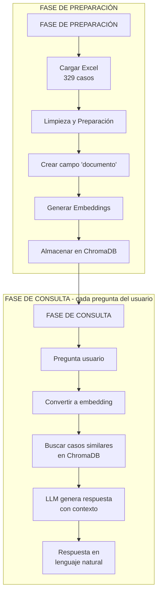

# Asesor Legal para Consulta de Historia de Demandas
Prueba de concepto para modernizar la consulta de historias de demandas mediante Inteligencia Artificial Generativa.
## Contexto
Un consultorio legal asesora a sus clientes revisando manualmente un archivo Excel con historias de demandas y sentencias. Los abogados deben buscar fila por fila la información relevante, un proceso lento y susceptible a errores.
Este proyecto busca desarrollar una PoC que utiliza IA Generativa para automatizar consultas y responder en lenguaje claro, accesible para personas sin conocimientos legales.

## Objetivos

- Ofrecer asesoría automática de primer nivel
- Liberar tiempo de los abogados para casos complejos
- Mejorar la precisión de las respuestas

## Enfoque Técnico

Alternativas Evaluadas

- **Búsqueda por palabras clave (baseline):** rápida, pero sensible a sinónimos/variaciones.  
- **TF-IDF/BM25:** robusto en texto clásico, pero sin semántica profunda.  
- **RAG (Embeddings + Vector Store + LLM):** Es el más sofisticado. Convierte los textos en "vectores" (números) que capturan el significado, no solo las palabras exactas. Así se puede encontrar casos relacionados aunque usen palabras diferentes.

### ¿Por qué RAG?

- Encuentra casos relevantes independientemente de la redacción exacta
- Genera respuestas en lenguaje natural y coloquial
- No inventa información, solo usa casos documentados

## Flujo de Funcionamiento

**Dataset:** 
- Filas: **329**
- Columnas: `#`, `Relevancia`, `Providencia`, `Tipo (todo vacío)`, `Fecha Sentencia`, `Tema - subtema`, `resuelve`, `sintesis`.

## Ejemplos de Consultas

- ¿Cuáles son las sentencias de 3 demandas?
- ¿De qué se trataron esas demandas?
- ¿Cuál fue la sentencia del caso sobre acoso escolar?
- ¿Existen casos sobre PIAR y cuáles fueron sus sentencias?

## Estado Actual
**Completado:**

- Análisis del problema y definición de alcance
- Evaluación de alternativas técnicas
- Diseño de arquitectura RAG
- Limpieza y preparación de datos
- Generación de embeddings

**Pendiente:**

- Indexación en ChromaDB
- Implementación del sistema de retrieval
- Integración con LLM
- Testing y validación

## Supuestos y Limitaciones

- El sistema complementa, no reemplaza, el trabajo de abogados
- Respuestas basadas únicamente en casos documentados
- Si no hay evidencia, el sistema indica que no encuentra información

---

**Nota**: Para más detalles técnicos, consultar `notes.md` y `report.md`.

---

## Contacto 
Puedes escribirme al email: [nbaezhuber@gmail.com](mailto:nbaezhuber@gmail.com)

