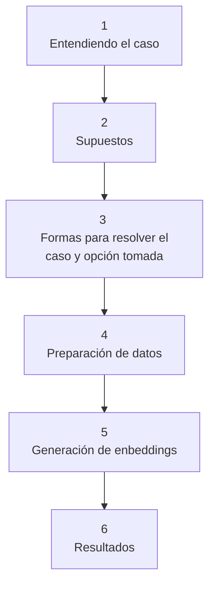
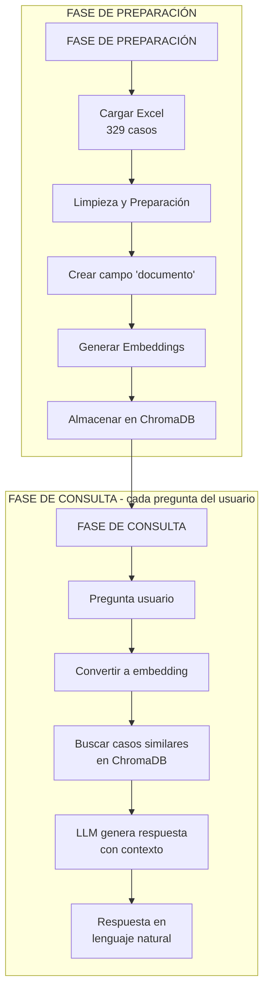
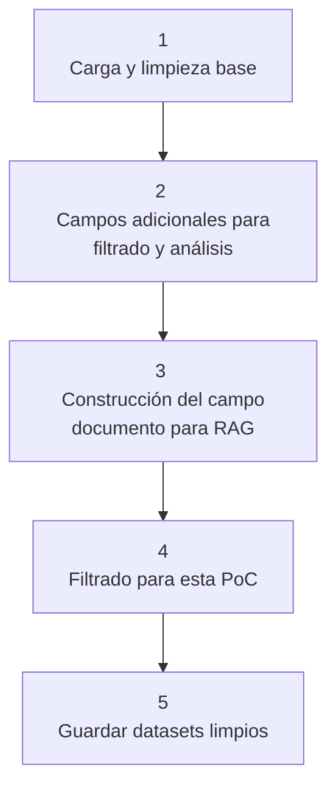

# Notas del proyecto 
## Asesor legal para consultar historia de demandas. 

Estas son mis notas pesonales del proyecto, las cuales me ayudaron a entender, organizar, estructurar y documentar mis ideas durante el desarrollo de este. Para ver una versión  curada de estas se recomienda ver el documento `report.md`. 

## Esquema de trabajo (primera versión)

## 1. Entendiendo el caso 

**Nombre del proyecto:** _Asesor legal para consultar historia de demandas_

**Descripción:** El consultorio legal actualmente asesora a sus clientes revisando un archivo de Excel que contiene la historia de demandas y sus sentencias. Este proceso es manual y consume tiempo, ya que los abogados deben buscar fila por fila la información relevante para responder preguntas de los clientes.

La empresa busca modernizar este proceso mediante una prueba de concepto (PoC) que utilice Inteligencia Artificial Generativa para responder preguntas de forma automática, en un lenguaje claro y comprensible para personas sin conocimientos de derecho.

Para esta prueba se decidió concentrar el análisis en demandas relacionadas con redes sociales, y se definieron varias preguntas de ejemplo a resolver.

**Objetivos:** 

- Ofrecer un primer nivel de asesoría automática, dejando a los abogados únicamente los casos más complejos.
- Mejorar la precisión de las respuestas entregadas a los clientes.

**Categorías:** Herramientas de consultoría legal, Optimización de procesos, IA generativa.  

**Motivación:** Poner en práctica mis conocimientos para una prueba técnica.

**Preguntas ejemplo:** 
- ¿Cuáles son las sentencias de 3 demandas?
- ¿De qué se trataron esas demandas?
- ¿Cuál fue la sentencia del caso sobre acoso escolar?
- ¿Cuál es el detalle de esa demanda?
- ¿Existen casos que hablen sobre el PIAR, y cuáles fueron sus sentencias?

**Dataset:** 
- Filas: **329**
- Columnas: `#`, `Relevancia`, `Providencia`, `Tipo (todo vacío)`, `Fecha Sentencia`, `Tema - subtema`, `resuelve`, `sintesis`.

## 2. Supuestos 

- Cada fila del Excel corresponde a **un caso** con campos: `Providencia`, `Tema - subtema`, `resuelve`, `sintesis`, `Fecha Sentencia`, etc.  
- El sistema **no reemplaza** al abogado; provee respuestas iniciales y referencias a los casos.  
- El alcance de la PoC se limita a **redes sociales** y a responder en **lenguaje coloquial**.  
- En ausencia de evidencia en los datos, el sistema debe **decir que no encuentra información** (sin inventar).

## 3. Formas para resolver el caso y opción tomada

Se evaluaron tres enfoques técnicos diferentes para resolver el problema de búsqueda y recuperación de información:

| Enfoque | Descripción | Ventajas | Desventajas | Complejidad |
|---------|-------------|----------|-------------|-------------|
| **Búsqueda por palabras clave** | Filtrado mediante `str.contains()` en columnas relevantes | • Implementación inmediata • Sin dependencias externas • Rápido | • No entiende sinónimos • Sensible a errores tipográficos • Búsquedas muy literales | Muy baja |
| **TF-IDF / BM25** | Recuperación lexical con ponderación de términos relevantes | • Mejor que búsqueda básica • Robusto ante ruido • Fácil de explicar | • No captura significado semántico • Requiere vectorizador e índice | Baja |
| **RAG (Embeddings + Vector Store + LLM)** | Búsqueda semántica mediante vectores y generación de respuestas en lenguaje natural | • Encuentra casos aunque varíe la redacción • Respuestas en lenguaje natural • Comprensión semántica profunda | • Requiere modelo de embeddings • Necesita vector store • Mayor complejidad técnica | Media |

- **Búsqueda por palabras clave (baseline):** rápida, pero sensible a sinónimos/variaciones.  
- **TF-IDF/BM25:** robusto en texto clásico, pero sin semántica profunda.  
- **RAG (Embeddings + Vector Store + LLM):** Es el más sofisticado. Convierte los textos en "vectores" (números) que capturan el significado, no solo las palabras exactas. Así se puede encontrar casos relacionados aunque usen palabras diferentes.

**Opción perseguida en esta PoC:** RAG con `sentence-transformers` para **embeddings** y `ChromaDB` como **vector store**, con una capa de respuesta en lenguaje coloquial.

### Flujo de funcionamiento 

### ¿Qué son los Embeddings?

Los embeddings son representaciones numéricas del texto que capturan su significado semántico. 

### Función de ChromaDB

ChromaDB actúa como una base de datos vectorial especializada que:
1. Almacena los embeddings de los 329 casos
2. Permite búsquedas por similitud matemática 
3. Recupera los casos más relevantes para una consulta en milisegundos

## 4. Preparación de datos

Para esta parte del proyecto se seguirá el siguiente esquema en código 

- **Limpieza:** normalización de texto, imputación de nulos (por ejemplo, `Tema - subtema` → “No especificado”), creación de un campo **`documento`** por fila combinando lo relevante para indexación y Q&A.  
- **Etiquetas útiles:** banderas para redes sociales, “acoso escolar” y “PIAR”.  
- **Salidas:**  
  - `sentencias_limpio_full.csv` (dataset limpio)  
  - `sentencias_rag_base.csv` (subset enfocado a RAG)

## 5. Generación de enbeddings 

**Modelo utilizado:** `SentenceTransformer("all-MiniLM-L6-v2")`

**Características del modelo:**
- Optimizado para español e inglés
- Genera vectores de 384 dimensiones
- Balance óptimo entre calidad y velocidad
- Modelo ligero (23MB) apto para producción

**Vector Store (Chroma):** En proceso...  

## 6. Resultados

 **Completado:**
- Análisis del problema y definición de alcance
- Evaluación de alternativas técnicas
- Diseño de arquitectura RAG
- Limpieza y preparación de datos (329 casos)
- Generación de embeddings con SentenceTransformers

**Pendiente:**
- Indexación en ChromaDB
- Implementación de sistema de retrieval
- Integración con LLM para generación de respuestas
- Testing y validación

