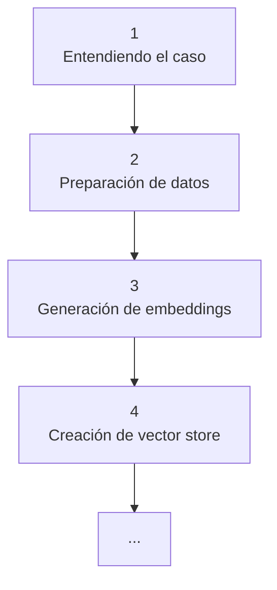

# Notas del proyecto 
## Asesor legal para consultar historia de demandas. 

Estas son mis notas pesonales del proyecto, las cuales me ayudaron a entender, organizar, estructurar y documentar mis ideas durante el desarrollo de este. Para ver una versión  curada de estas se recomienda ver el documento `report.md`. 

## Esquema de trabajo (primera versión)

## 1. Entendiendo el caso 

**Nombre del proyecto:** _Asesor legal para consultar historia de demandas_

**Descripción:** El consultorio legal actualmente asesora a sus clientes revisando un archivo de Excel que contiene la historia de demandas y sus sentencias. Este proceso es manual y consume tiempo, ya que los abogados deben buscar fila por fila la información relevante para responder preguntas de los clientes.

La empresa busca modernizar este proceso mediante una prueba de concepto (PoC) que utilice Inteligencia Artificial Generativa para responder preguntas de forma automática, en un lenguaje claro y comprensible para personas sin conocimientos de derecho.

Para esta prueba se decidió concentrar el análisis en demandas relacionadas con redes sociales, y se definieron varias preguntas de ejemplo a resolver.

**Objetivos:** Comprobar si una solución basada en sistemas RAG (Retrieval-Augmented Generation) puede ayudar a:

- Ofrecer un primer nivel de asesoría automática, dejando a los abogados únicamente los casos más complejos.
- Mejorar la precisión de las respuestas entregadas a los clientes.

**Categorías:** Herramientas de consultoría legal, Optimización de procesos, IA generativa, Sistemas RAG.  

**Motivación:** Poner en práctica mis conocimientos para una prueba técnica.

**Preguntas ejemplo:** 
- ¿Cuáles son las sentencias de 3 demandas?
- ¿De qué se trataron esas demandas?
- ¿Cuál fue la sentencia del caso sobre acoso escolar?
- ¿Cuál es el detalle de esa demanda?
- ¿Existen casos que hablen sobre el PIAR, y cuáles fueron sus sentencias?

**Dataset:** 
- Filas: **329**
- Columnas: `#`, `Relevancia`, `Providencia`, `Tipo (todo vacío)`, `Fecha Sentencia`, `Tema - subtema`, `resuelve`, `sintesis`.

